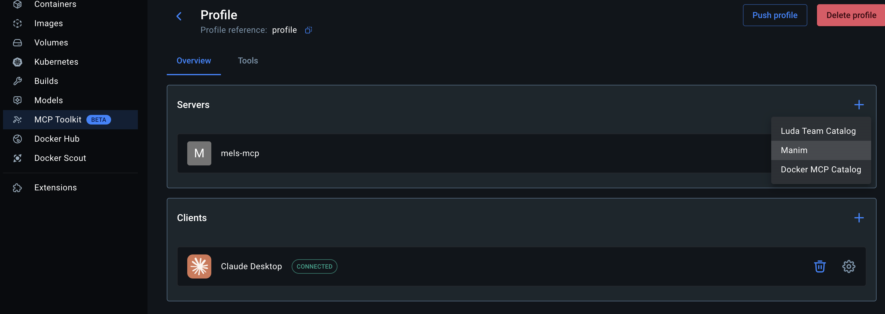
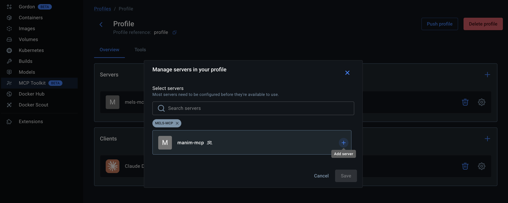
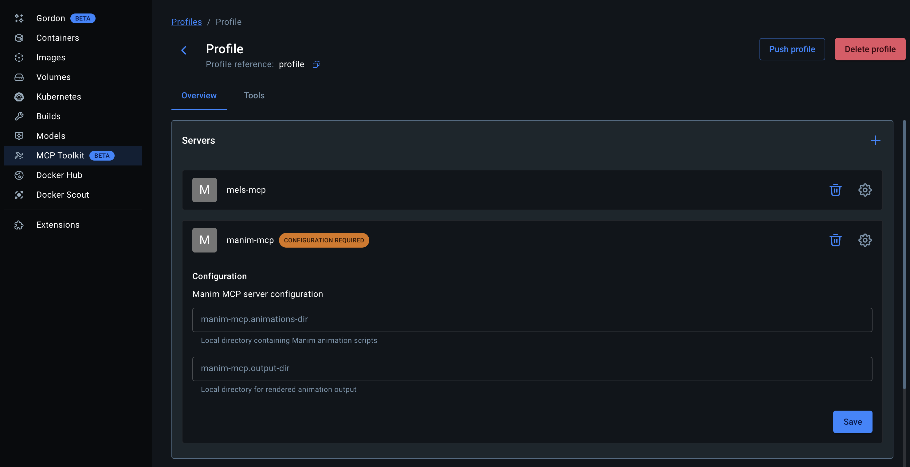

# Manim MCP


A self-labeling stdio MCP server Docker image for creating mathematical animations with [Manim](https://www.manim.community/). Designed for use with Docker MCP toolkit catalogs and profiles.

## Overview

This project provides:

1. **Containerized Manim Environment**: Run Manim in an isolated, reproducible Docker container
2. **MCP Integration**: AI assistants like Claude interact directly via the Model Context Protocol (stdio transport)
3. **File Management**: Create, read, and manage animation scripts and rendered output inside the container
4. **Docker MCP Toolkit**: Self-labeling image with `io.docker.server.metadata` for catalog/profile integration

## Quick Start

### Prerequisites

- [Docker Desktop](https://docs.docker.com/get-docker/) with MCP Toolkit enabled

### Step 1: Build the Docker Image

Clone the repository and build the image with the embedded MCP metadata label:

```bash
git clone https://github.com/LudaThomas/manim-mcp.git
cd manim-mcp
docker build --label "io.docker.server.metadata=$(cat server-metadata.yaml)" -t manim-mcp:latest .
```

This builds the image and embeds the MCP server metadata from `server-metadata.yaml` as the `io.docker.server.metadata` Docker label. This label is what makes the image self-describing — the Docker MCP Toolkit can read it to discover the server's name, command, volumes, and configuration schema automatically.

Alternatively, use the included build script:

```bash
./build.sh
```

### Step 2: Create a Catalog Entry

Register the image as an MCP catalog so it can be discovered in Docker Desktop:

```bash
mcp catalog create luda/manim:latest --title "Manim" --server docker://manim-mcp:latest
```

This creates a catalog entry titled "Manim" that points to your locally built `manim-mcp:latest` image.

### Step 3: Add the Catalog to a Profile

In Docker Desktop, navigate to **MCP Toolkit** in the sidebar, then open your profile. Click the **+** button in the **Servers** section to see available catalogs. You'll see your "Manim" catalog listed alongside any other catalogs you have configured.



### Step 4: Add the Server to the Profile

From the catalog list, select the Manim catalog. In the "Manage servers in your profile" dialog, you'll see `manim-mcp` available. Click the **+** button next to it to add it to your profile, then click **Save**.



### Step 5: Configure the Server

After adding the server, it will appear in your profile with a **CONFIGURATION REQUIRED** badge. Expand it to fill in the two required volume mount paths:

- **manim-mcp.animations-dir** — Local directory containing your Manim animation scripts
- **manim-mcp.output-dir** — Local directory where rendered animations will be saved

Click **Save** to apply the configuration.



The server is now ready to use. Any MCP client connected to this profile (e.g., Claude Desktop) will have access to the Manim tools.

## MCP Tools

The server exposes four tools over stdio:

### `list_files`
Browse the container filesystem. Supports recursive listing, hidden files, glob patterns, and depth control.

### `write_file`
Create or overwrite files in the container. Supports automatic parent directory creation.

### `read_file`
Read text file contents from the container.

### `run_manim`
Execute Manim to render a scene. Returns job ID, command output, and information about generated files.

**Quality settings:**

| Quality | Resolution | Frame Rate | Best For |
|---------|------------|------------|----------|
| `low_quality` | 480p | 15fps | Quick previews |
| `medium_quality` | 720p | 30fps | General use |
| `high_quality` | 1080p | 60fps | Presentations |
| `production_quality` | 1440p | 60fps | Production videos |

**Additional options:** transparent background, custom resolution/frame rate/color, save last frame only, animation range selection, and arbitrary extra Manim CLI flags.

## Creating Animations

Create a Python file with Manim scene classes:

```python
from manim import *

class CircleToSquare(Scene):
    def construct(self):
        circle = Circle()
        circle.set_fill(BLUE, opacity=0.5)

        square = Square()
        square.set_fill(RED, opacity=0.5)

        self.play(Create(circle))
        self.wait()
        self.play(Transform(circle, square))
        self.wait()
```

An AI assistant connected via MCP can then use the `write_file` tool to create the script and `run_manim` to render it.

## Project Structure

```
manim-mcp/
├── app/
│   └── main.py               # MCP server (stdio transport)
├── animations/                # Example animation scripts
│   └── example.py
├── output/                    # Rendered animation output (volume mount)
├── Dockerfile                 # Container image definition
├── docker-compose.yml         # Development compose config
├── build.sh                   # Build script (applies metadata label)
├── server-metadata.yaml       # MCP server metadata for Docker label
└── README.md
```

## Architecture

### Conversion from Web API to stdio MCP

This project was originally built as a FastAPI web server exposing HTTP endpoints (`/list-files`, `/write-file`, `/run-manim`, `/download-file`). It has been fully converted to a **stdio-based MCP server** using the `mcp` Python SDK (`FastMCP`).

Key changes in the conversion:

- **Removed**: FastAPI, uvicorn, HTTP routing, port exposure, `/docs` endpoint, file download endpoint
- **Added**: `FastMCP` server with `transport="stdio"`, Docker MCP metadata label
- **Transport**: All communication happens over stdin/stdout using the MCP protocol (no network ports)
- **Security**: Path traversal protection and directory allowlisting remain in place
- **Docker integration**: The image self-labels with `io.docker.server.metadata` so it can be discovered and configured by Docker MCP toolkit catalogs

### Security

The server restricts filesystem access to a set of allowed base directories (`/manim`, `/app`, `/media`, `/usr/local`, `/tmp`) and blocks path traversal attempts.

## Advanced Usage

### Custom LaTeX

The container includes a minimal LaTeX installation for mathematical typesetting:

```python
formula = MathTex(r"\int_{a}^{b} f(x) \, dx = F(b) - F(a)")
self.play(Write(formula))
```

### Development with docker-compose

The `docker-compose.yml` is provided for local development and testing:

```bash
docker compose build
docker compose run manim-mcp
```

It mounts `./animations`, `./output`, and `./media` into the container.

## Troubleshooting

- **Docker not running**: Make sure the Docker daemon is running
- **Permission errors**: The container needs write access to mounted volumes
- **Missing output**: Check the `output/` directory (mounted volume) for rendered files
- **LaTeX errors**: Ensure your LaTeX syntax is valid; the container has a minimal TeX installation

## License

This project is licensed under the Apache License 2.0 - see the [LICENSE](LICENSE) file for details.

## Acknowledgements

- [wstcpyt/manim-mcp](https://github.com/wstcpyt/manim-mcp) — the original project this was forked from
- [Manim Community](https://www.manim.community/) for the animation engine
- [Model Context Protocol](https://modelcontextprotocol.io/) for the AI integration standard
